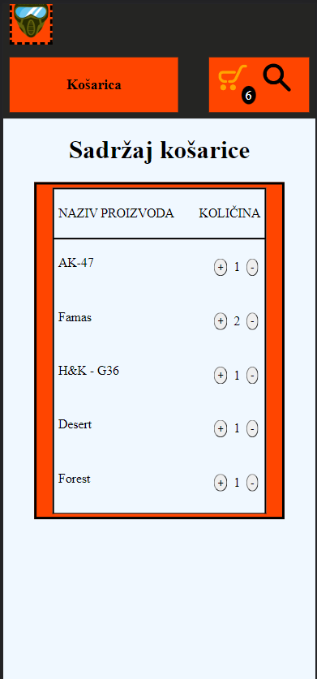

# Airsoftgear Website

This website was built for a laboratory exercise within the FER <a href="https://www.fer.unizg.hr/en/course/wamsd">web development course</a>

The website can be launched by installing all dependencies listed in "package.json", installing node.js and running "node server.js" in the command line.

## Project details

<ul>
    <li>The frontend uses HTML5, CSS and JavaScript</li>
    <li>The backend is built using NodeJS and the <a href="https://expressjs.com/">Express</a> web framework</li>
    <li>Templating is achieved using <a href="https://ejs.co//">EJS</a></li>

</ul>

### Homepage

The homepage is built responsive and reacts to the viewport size. 

    
    
    
    

    
When the website is launched a script starts that fetches all of the categories, the data for the first category and then displays it. All subsequent clicks on a certain category trigger an API call for the data of said category on the backend

    
The user has the ability to add items to the cart. When the user hovers over an item a yellow cart icon appears allowing the user to click it and add the item to the cart. An item counter appears upon adding the first item corresponding to the number of items in the cart.

    
Whenever an item is added to the cart a script is triggered uploading the cart update to the server.

      

### Cart

The cart is designed responsive as well.

    
    
    

    
The items in the cart are fetched from the server using an API call and a local script. The user has the ability to increase or reduce the amount of items in the cart. Each action triggers a script that updates the status on the server and displays the new update on the browser.

    
The user can navigate back to the home page by clicking the web page icon in the top left.

